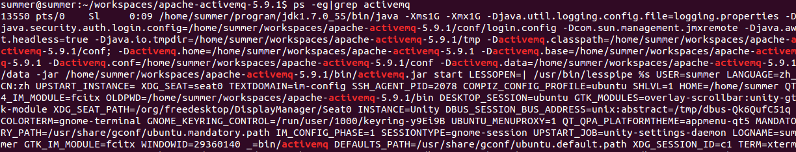
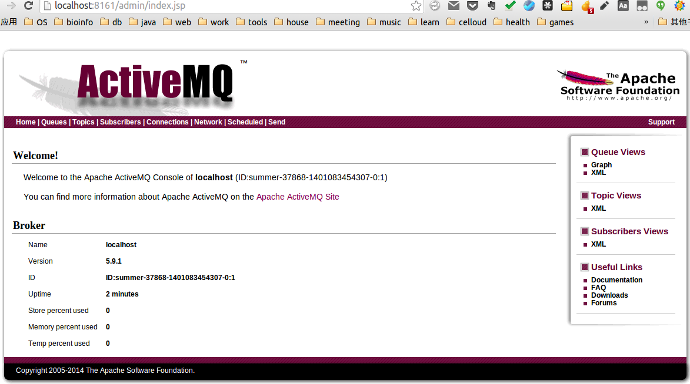

#写在前面的话
公司一些项目已经使用了JMS相关的组件，我们的项目接下来可以在某些功能上也会使用此组件，公司其他项目使用的HornetQ，为了方便接下来项目的进展，前期对相关的JMS中间件进行技术了解。
#前期准备
    操作系统：ubuntu14.04  64位
    ActiveMQ：5.9.1 下载地址：http://activemq.apache.org/download.html
    JDK:1.7.0_55

#安装
参考官方的文档，在个人目录/workspace/下面解压缩ActiveMQ包:

    tar -zxvf  apache-activemq-5.9.1-bin.tar.gz

#运行
使用命令cd 到workspace目录，执行下面的启动activemq命令

    bin/activemq
    *注意，上面的命令时官方文档中的命令，不过使用这个命令进行启动时是不会成功的，有资料显示此命令是activemq低版本时的启动命令，高版本必须在命令后面增加一个参数start，完整命令如下：*
    bin/activemq start

另外还可以直接使用一下命令进行启动：

    bin/activemq console

启动成功可以看到一下界面：

#验证
通过以下命令查看ActiveMQ是否成功，如下图所示：

    ps -ef|grep activemq

#停止
ActiveMQ的停止命令如下：

    bin/activemq stop

或者通过上一步验证获取到的进程的id，直接使用kill命令杀死即可。

#基本管理
你可以通过浏览器访问以下地址来监控ActiveMQ

    http://localhost:8161/admin

