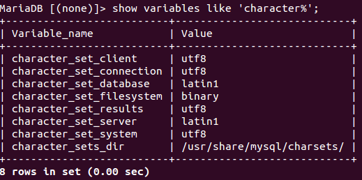
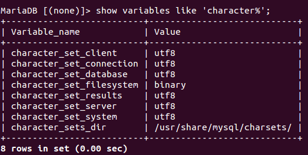

这种设置方式是在mariadb最初的版本中可以，当时本人的mariadb是从mysql升级过来的。
在新版本中的设置方式和这个有些区别，请参考最新的博文（稍后推出）。

在本机上安装了mariadb尝试使用，插入中文数据时发现乱码，估计和mysql一样需要设置数据库编码格式，首先通过命令`mysql -uroot -p123456`进入数据库，然后使用`show variables like 'character%';`查看当前数据库的编码，如下图：



在上图我们可以看出来，我们需要修改latin1编码为utf8，我们先找到mysql的配置文件，在ubuntu中文件的位置为/etc/mysql/my.cnf，直接使用命令`sudo vim /etc/mysql/my.cnf`打开文件，在【mysqld】下面增加一行配置

```
character-set-server = utf8
```

退出保存即可，然后重新启动数据库：`sudo /etc/init.d/mysql restart`
再次进入数据库，使用上面的命令查看数据库的编码，结果如下图：



[注意：]如果在安装mysql或者mariadb的过程中没有调整默认编码，可能还会出现乱码的情况，比如控制台乱码或者客户端乱码，这里我们还需要增加一些配置来进行调整。
最终我们需要调整的配置如下：

```
[client]下增加default-character-set=utf8
[mysqld]下增加character-set-server = utf8
[mysql] 下增加default-character-set=utf8
```

