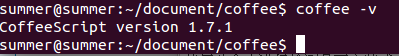

#写在前面的话#
CoffeeScript编译器是用CoffeeScript写成的，这就产生了一个先有鸡还是先有蛋的问题：我们是如何在一个还没装CoffeeScript编译器的系统上运行编译器的呢？如果能找到某种方法，在机器上浏览器之外运行JavaScript代码，且允许这些代码访问本地文件系统就好了……

对，其实我们有Node.js！大家把Node当成一个JavaScript的Web服务器，但是它可不止这个功能。从根本上讲，它是JavaScript代码和操作系统之间的一个桥梁。Node也有一个名为npm的很棒的工具，即Node包管理器（Node Package Manager） 。如果你是Ruby程序员，可以将其想象为Node版的RubyGems 。npm已经成为安装管理Node程序和类库约定俗成的标准了。

#安装nodejs和npm
由于我的操作系统是ubuntu14.04，所以根据nodejs官方文档说明进行安装：

```
sudo apt-get install nodejs
sudo apt-get install npm
sudo apt-get install nodejs-legacy
```

完成这三个命令就可以在控制台进行检测是否安装成功。使用如下命令进行检查：

```
node -v
npm -v
```

如下图所示，成功。


#安装coffeescript
接下来再进行安装coffeescript很简单了，一条命令即可搞定：

```
sudo npm install -g coffee-script
```

使用此命令进行检测是否安装成功：

```
coffee -v
```

显示如下图即成功：

