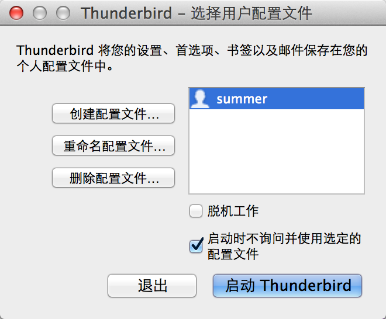

#写在前面的话#
一直希望找一个很好的邮件客户端，可以很好的帮助查收邮件，同时又可以很方便的备份邮件。随着工作时间积累，很多工作都在存在在邮件中。
开始工作主要在windows下面进行，随后来到北京后慢慢习惯了ubuntu操作系统的方便，不过最近随着自己的小黑下岗之后，便入手了mac book，所以很希望找一个跨平台的邮件客户端。所以本人选择了Thunderbird客户端，可以在三个平台中安装使用。
另外，为了方便在三个平台中邮件数据的同步，本人使用了dropbox进行数据的同步。这样把邮件信息保存在dropbox中，可以很方便的在不同的平台中进行同步。
但是问题出现了，安装thunderbird客户端都是默认在某个文件夹中，怎么才可以把邮件设置到dropbox中，让邮件自动收发保存在dropbox中呢？
#修改配置#
了解不同操作系统下存放配置文件的位置，对我们还是很重要的。
##找出配置文件##
现在我们先熟悉一下thunderbird默认安装时的配置文件存放位置：

1、Windows xp，vista等:C:\Documents and Settings\[User Name]\Application Data\Thunderbird\
2、Windows 7 : C:\Users\[User Name]\AppData\Local\Thunderbird\
3、Ubuntu:/home/[User Name]/.thunderbird/
4、Mac OS:/Users/[User Name]/Library/Thunderbird/
##创建新配置文件##
了解了默认的存放位置，我们创建新的配置文件。要创建一个新配置文件夹，您得使用配置文件管理器。

在 Windows 下，请按下面的步骤启动配置文件管理器：
*完全退出 Thunderbird (从 Thunderbird 主菜单选择 文件 > 退出)。
*点击 Windows 的开始菜单的 开始 > 运行...
*输入 thunderbird.exe -profilemanager 再按下OK。

在Ubuntu下
用 -profilemanager 这个参数运行 Thunderbird ，例如 ./thunderbird -profilemanager (假设您正处于 Thunderbird 目录下) 。

在Mac OS 下
使用和ubuntu一样的命令即可：用 -profilemanager 这个参数运行 Thunderbird ，例如 ./thunderbird -profilemanager。执行这个命令必须cd到thunderbird命令目录下面。

不过有的人还是用下面的方式，不过我没有试验成功：
按下选项键再双击 Thunderbird 图标。

经过上面的操作，我们可以看到下面的界面：

点击“创建配置文件”按照提示步骤一步一步操作即可。

##邮件备份##
在thunderbird中，可以找到三个文件：“Crash Reports”,"XXXXXXXX.default","profiles.ini"，将XXXXXXXX.default整个文件夹打包备份即可 。
根据上面的创建新的配置文件过程，我的备份数据的文件夹创建在了dropbox目录下面，所以这个文件夹中的所有数据会自动同步到dropbox中，可以在不同的客户端中进行同步。
##从备份中还原配置文件##
如果我们切换了系统或者重新安装了系统，我们就需要对数据进行恢复。因为我的邮件数据都是使用dropbox进行同步，所以只要安装了dropbox后，邮件数据就同步到了新的环境中，但是在新的环境中需要配置thunderbird来识别邮件。修改配置文件如下：
我们在系统的默认配置文件存放处找到 ：profiles.ini 配置文件，使用文本编辑器打开文件，更改 Path= 这一行，并使其指向新位置的路径，同时修改IsRelative=1 改为 IsRelative=0，保存，重新启动即可。
下面是本人的配置：

···
IsRelative=0
Path=/Users/[UserName]/Dropbox/work/Thunderbird/Profiles/iir5qptn.summer
···

完成。