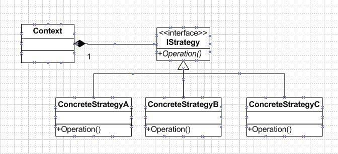

#说明

本篇文章的代码在github上，感兴趣的可以下载：[源码](https://github.com/sdyz5210/fee/tree/master/src/main/java/com/summer/design/patterns/strategy)

#策略模式

在策略模式中(strategy pattern)，一个类的行为或其算法可以在运行时更改。这种类型的设计模式属于行为型模式。策略模式又叫算法簇模式，就是定义了不同的算法类，并且之间可以互相替换。此模式让算法的变化独立于使用算法的客户。策略模式的好处在于你可以动态的改变对象的行为

* 意图:定义一系列的算法，把它们一个个封装起来，并且使他们可以相互替换。
* 主要解决:在有多种算法相似的情况下，使用if...else所带来的复杂和难以维护。
* 何时使用:一个系统有许多类，而区分他们的只是他们直接的行为
* 如何解决:将这些算法封装成一个一个的类，任意地替换。
* 关键代词:实现同一个接口
* 应用实例：
 * 诸葛亮的锦囊妙计，每一个锦囊就是一个策略。
 * 旅行的出游方式，选择自行车、汽车、飞机，每一种旅行方式都是一个策略
 * JAVA AWT中的LayoutManager
* 优点:算法可以自由切换、避免使用多重条件判断、扩展性良好
* 缺点:策略类会增多、所有策略类都需要对外暴露
* 使用场景
 * 如果一个系统中有很多类，他们之间的区别仅在于他们的行为，那么使用策略模式可以动态地让一个对象在许多行为中选择一种行为。
 * 系统需要动态地在几种算法中选择一种。
 * 如果一个对象有很多的行为，如果不用恰当的模式，这些行为就只好使用多重的条件选择语句来实现。
* 如果一个系统的策略多于四个，就需要考虑使用混合模式，解决策略类膨胀的问题。

#设计原则

设计原则是把一个类中的经常改变或者将来可能改变的部分提取出来，作为一个接口，然后在类中包含这个对象的实例，这样类的实例在运行时就可以随意调用实现了这个接口的类的行为。

策略模式主要针对一组算法，将每一个算法封装到具有共同接口的独立的类中，从而使得他们可以相互替换。策略模式使得算法可以在不影响到客户端的情况下发生变化。通过策略模式适用于当一个应用程序需要实现一种特定的服务或者功能，而且该程序有多重实现方式时使用。

