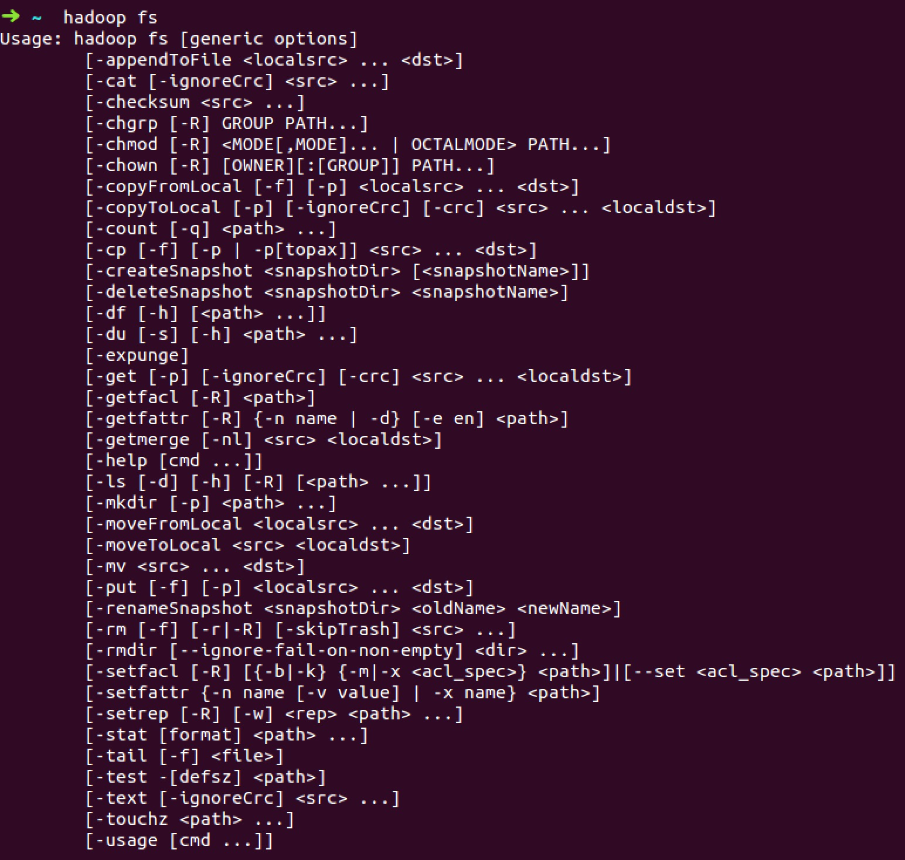

#HDFS中shell命令语法格式

HDFS 是Hadoop分布式文件系统，那么对HDFS的操作，就是文件系统的基本操作，比如文件的创建、修改、删除、修改权限等，文件夹的创建、删除、重命名等。对HDFS 的操作命令类似于lLinux 的shell 对文件的操作，如ls、mkdir、rm 等。
我们可以再已经安装HDFS文件系统的操作系统上使用‘hadoop fs’ 看到基本命令，如下图： 

  

#命令解释  

<table style="width: 100%; height: 100%;" border="1" cellspacing="0" cellpadding="0">
<tbody>
<tr>
<td width="115">

选项名称

</td>
<td width="403">

使用格式

</td>
<td width="163">

含义

</td>
</tr>
<tr>
<td valign="top" width="115">

-ls 

</td>
<td valign="top" width="403">

-ls &lt;路径&gt; 

</td>
<td valign="top" width="163">

查看指定路径的当前目录结构

</td>
</tr>
<tr>
<td valign="top" width="115">

-lsr 

</td>
<td valign="top" width="403">

-lsr &lt;路径&gt; 

</td>
<td valign="top" width="163">

递归查看指定路径的目录结构

</td>
</tr>
<tr>
<td valign="top" width="115">

-du

</td>
<td valign="top" width="403">

-du &lt;路径&gt;

</td>
<td valign="top" width="163">

统计目录下各文件大小

</td>
</tr>
<tr>
<td valign="top" width="115">

-dus

</td>
<td valign="top" width="403">

-dus &lt;路径&gt; 

</td>
<td valign="top" width="163">

汇总统计目录下文件(夹)大小

</td>
</tr>
<tr>
<td valign="top" width="115">

-count 

</td>
<td valign="top" width="403">

-count [-q] &lt;路径&gt; 

</td>
<td valign="top" width="163">

统计文件(夹)数量

</td>
</tr>
<tr>
<td valign="top" width="115">

-mv

</td>
<td valign="top" width="403">

-mv &lt;源路径&gt; &lt;目的路径&gt; 

</td>
<td valign="top" width="163">

移动

</td>
</tr>
<tr>
<td valign="top" width="115">

-cp

</td>
<td valign="top" width="403">

-cp &lt;源路径&gt; &lt;目的路径&gt; 

</td>
<td valign="top" width="163">

复制

</td>
</tr>
<tr>
<td valign="top" width="115">

-rm

</td>
<td valign="top" width="403">

-rm [-skipTrash] &lt;路径&gt; 

</td>
<td valign="top" width="163">

删除文件/空白文件夹

</td>
</tr>
<tr>
<td valign="top" width="115">

-rmr

</td>
<td valign="top" width="403">

-rmr [-skipTrash] &lt;路径&gt;

</td>
<td valign="top" width="163">

递归删除

</td>
</tr>
<tr>
<td valign="top" width="115">

-put 

</td>
<td valign="top" width="403">

-put &lt;多个linux上的文件&gt; &lt;hdfs 路径&gt; 

</td>
<td valign="top" width="163">

上传文件

</td>
</tr>
<tr>
<td valign="top" width="115">

-copyFromLocal 

</td>
<td valign="top" width="403">

-copyFromLocal &lt;多个linux 上的文件&gt; &lt;hdfs 路径&gt;

</td>
<td valign="top" width="163">

从本地复制

</td>
</tr>
<tr>
<td valign="top" width="115">

-moveFromLocal 

</td>
<td valign="top" width="403">

-moveFromLocal &lt;多个linux 上的文件&gt; &lt;hdfs 路径&gt;

</td>
<td valign="top" width="163">

从本地移动

</td>
</tr>
<tr>
<td valign="top" width="115">

-getmerge 

</td>
<td valign="top" width="403">

-getmerge &lt;源路径&gt; &lt;linux 路径&gt; 

</td>
<td valign="top" width="163">

合并到本地

</td>
</tr>
<tr>
<td valign="top" width="115">

-cat

</td>
<td valign="top" width="403">

-cat &lt;hdfs 路径&gt; 

</td>
<td valign="top" width="163">

查看文件内容

</td>
</tr>
<tr>
<td valign="top" width="115">

-text 

</td>
<td valign="top" width="403">

-text &lt;hdfs 路径&gt; 

</td>
<td valign="top" width="163">

查看文件内容

</td>
</tr>
<tr>
<td valign="top" width="115">

-copyToLocal 

</td>
<td valign="top" width="403">

-copyToLocal [-ignoreCrc] [-crc] [hdfs 源路径] [linux 目的路径]

</td>
<td valign="top" width="163">

复制到本地

</td>
</tr>
<tr>
<td valign="top" width="115">

-moveToLocal

</td>
<td valign="top" width="403">

-moveToLocal [-crc] &lt;hdfs 源路径&gt; &lt;linux目的路径&gt;

</td>
<td valign="top" width="163">

移动到本地

</td>
</tr>
<tr>
<td valign="top" width="115">

-setrep

</td>
<td valign="top" width="403">

-setrep [-R] [-w] &lt;副本数&gt; &lt;路径&gt; 

</td>
<td valign="top" width="163">

修改副本数量

</td>
</tr>
<tr>
<td valign="top" width="115">

-mkdir

</td>
<td valign="top" width="403">

-mkdir &lt;hdfs 路径&gt; 

</td>
<td valign="top" width="163">

创建空白文件夹

</td>
</tr>
<tr>
<td valign="top" width="115">

-touchz

</td>
<td valign="top" width="403">

-touchz &lt;文件路径&gt;

</td>
<td valign="top" width="163">

创建空白文件

</td>
</tr>
<tr>
<td valign="top" width="115">

-stat

</td>
<td valign="top" width="403">

-stat [format] &lt;路径&gt; 

</td>
<td valign="top" width="163">

显示文件统计信息

</td>
</tr>
<tr>
<td valign="top" width="115">

-tail 

</td>
<td valign="top" width="403">

-tail [-f] &lt;文件&gt; 

</td>
<td valign="top" width="163">

查看文件尾部信息

</td>
</tr>
<tr>
<td valign="top" width="115">

-chmod

</td>
<td valign="top" width="403">

-chmod [-R] &lt;权限模式&gt; [路径] 

</td>
<td valign="top" width="163">

修改权限

</td>
</tr>
<tr>
<td valign="top" width="115">

-chown 

</td>
<td valign="top" width="403">

-chown [-R] [属主][:[属组]]路径

</td>
<td valign="top" width="163">

修改属主

</td>
</tr>
<tr>
<td valign="top" width="115">

-chgrp 

</td>
<td valign="top" width="403">

-chgrp [-R] 属组名称 路径

</td>
<td valign="top" width="163">

修改属组

</td>
</tr>
<tr>
<td valign="top" width="115">

-help 

</td>
<td valign="top" width="403">

-help -help [命令选项] 

</td>
<td valign="top" width="163">

帮助

</td>
</tr>
</tbody>
</table>