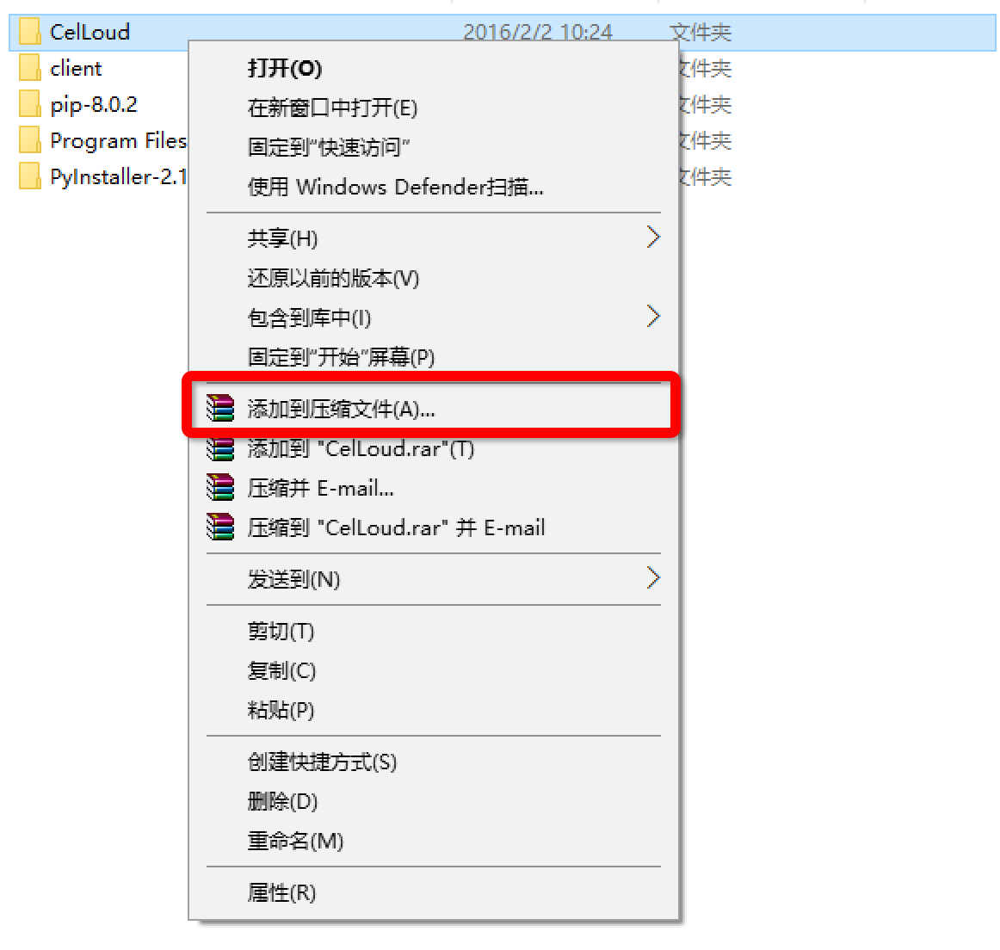
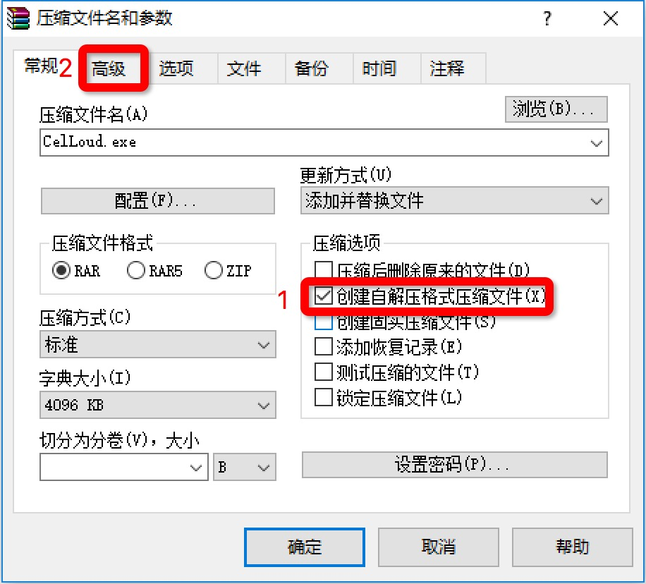
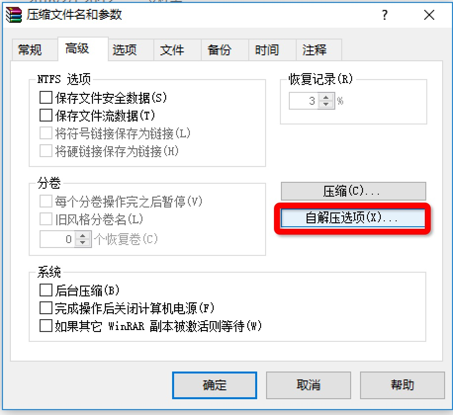
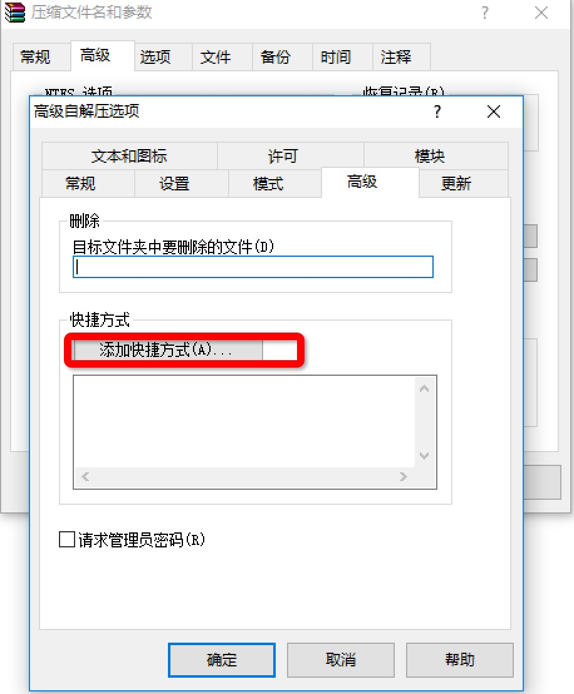
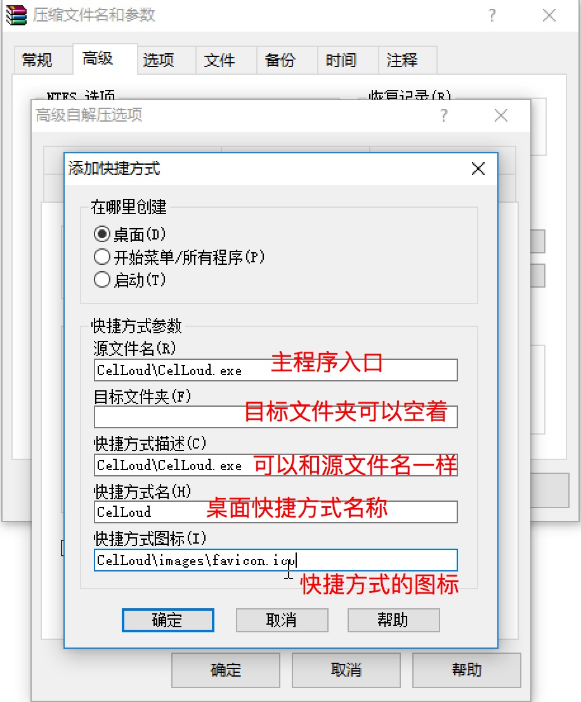

使用python编写的客户端程序，需要进行打包，所以选择使用pyinstaller进行打包。但是由于一些原因打包的程序要希望可以做到自解压缩格式，同时创建桌面快捷方式，所以就选择使用winrar进行处理。
前提说明，使用pyinstaller打包时，没有打成onefile形式，因为此类型对多进程有些影响。

使用winrar打包的过程如下：

第一步，右键选择需要打包的文件，选择'添加到压缩文件'
 

第二步，勾选'创建自解压缩格式压缩文件'，之后选择高级选项卡
 

第三步，选择自解压选项
 

第四部，在弹出来的窗口中，选择'高级'，后点击'点击添加快捷方式'
 

第五步,根据下图的说明填写

最后点击确定即可完成。 