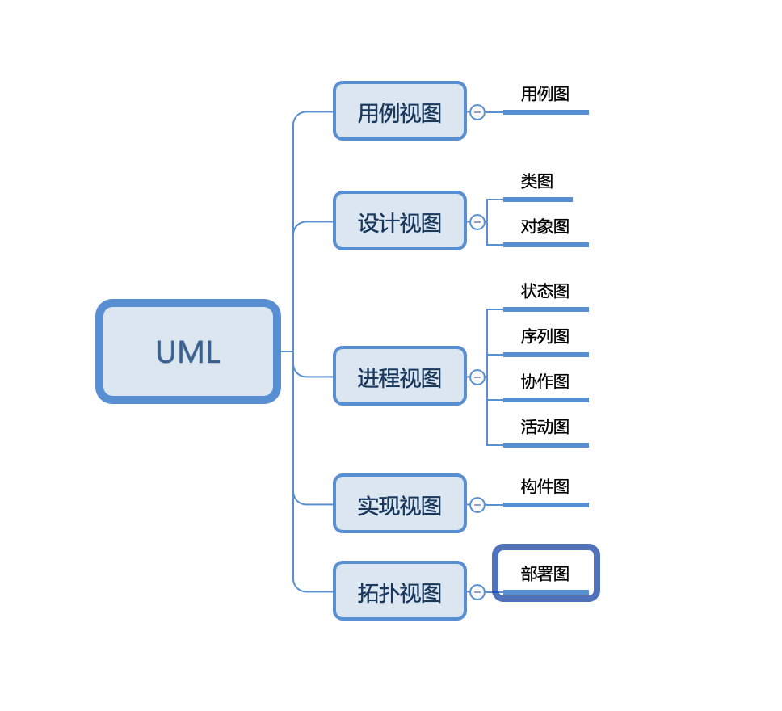

---

layout: post  
title: UML总结
date: 2019-09-05
tags: [UML]

---

### 前言

最近在准备硕士研究生的毕业论文，一开始还觉得自己的需求分析不会出现问题，结果被导师给怼了，同时又带领着又复习了一下UML的知识。在大学学习UML的时候没有和实际工作结合在一起，在需求分析过程中也仅仅用到了用例图，但是更进一步还是不清楚。所以借此机会梳理一遍。

### UML是什么

UML（Unified Modeling Language）是一种统一建模语言，为面向对象开发系统的产品进行说明、可视化、和编制文档的一种标准语言。UML有9种图，分别有不同的用途。

### 用例图

用例图（Use Case Diagram）是被称为参与者（Actor）的外部用户所能观察到的系统功能的模型图

* 列出系统中的用例和参与者
* 显示哪个参与者参与了哪个用例的执行

用例：系统中的一个功能单元，可以被描述为参与者与系统之间的一次交互作用

* 参与者、参与者泛化
* 用例与参与者之间的关系：关联
* 用例之间关系：扩展、包括、泛化

使用场景：业务建模、需求获取、定义

### 类图

类图描述系统中类的静态结构。在UML类图中，常见的有以下几种关系：泛化（Generalization）、实现（Realization）、关联（Association）、聚合（Appregation）、组合（Composition）、依赖（Dependency）。

各种关系的强弱顺序：泛化=实现>组合>聚合>关联>依赖

1. 泛化

   泛化是一种集成关系，表示一般与特殊的关系，它指定了子类如何继承父类的所有特征和行为。

2. 实现

   是一种类与接口的关系，表示类是接口所有特征和行为的实现

3. 组合

   组合关系是整体与部分的关系，但部分不能离开整体而独立存在。如公司和部门是整体和部门的关系

   组合关系是关联关系的一种，是比聚合关系还要强的关系。它要求普通的聚合关系中代表整体的对象负责代表部分的对象的生命周期。

   代码体现：成员变量

4. 聚合

   聚合关系是整体与部分的关系，且部分可以离开整体而单独存在。

   聚合关系是关联关系的一种，是强的关联关系；关联和聚合在语法上无法区分，必须考察具体的逻辑关系。

   代码体现：成员变量

5. 关联

   关联关系是一种拥有关系，它使一个类知道另一个类的属性和方法。

   代码体现：成员变量

6. 依赖

   依赖关系是一种使用的关系，即一个类的实现需要另一个类的协助，所以尽量不使用双向的互相依赖。

   代码表现：局部变量、方法的参数或者对静态方法的调用

### 对象图

描述的是参与交互的各个对象在交互过程中某一时间的状态。对象图可以被看作是类图在某一时间的实例。

### 状态图

是一种由状态、变迁、事件和活动组成的状态机，用来描述类的对象所有可能的状态以及时间发生状态的转移条件。

### 活动图

活动图是状态图的一种特殊情况，这些状态大都处于活动状态。本质是一种流程图，描述了活动到活动的控制流。活动图描述了一组顺序或并发的活动。

### 协作图

描述了收发消息的对象的组织关系，强调对象之间的合作关系。时序图按照时间顺序布图，而协作图是按照空间结构布图。

### 构件图

构件图是用来表示系统中构建与构建之间，类或接口与构建之间的关系图。其中，构件图之间的关系表现为依赖关系，定义的类或接口与类之间的关系表现为依赖关系或实现管理。

### 部署图

描述了系统运行时进行处理的结点以及在结点上活动的构建的配置。强调了物理设备以及之间的链接关系。

目的：描述一个具体应用的主要部署架构，通过对各种硬件，在硬件中的软件以及各种链接协议的显示，可以很好的描述系统是如何部署的；平衡系统运行时的计算资源分布；可以通过连接描述。

|        |          |          |          |          |          |
| ------ | -------- | -------- | -------- | -------- | -------- |
|        | 系统用户 | 分析人员 | 设计人员 | 开发人员 | 测试人员 |
| 用例图 | ✔️        | ✔️        |          |          | ✔️        |
| 类图   |          |          | ✔️        | ✔️        |          |
| 对象图 |          |          | ✔️        | ✔️        |          |
| 序列图 |          |          |          | ✔️        |          |
| 协作图 |          |          |          | ✔️        |          |
| 状态图 |          |          |          | ✔️        |          |
| 活动图 |          |          |          | ✔️        |          |
| 构件图 |          |          |          | ✔️        |          |
| 部署图 |          |          |          | ✔️        | ✔️        |

